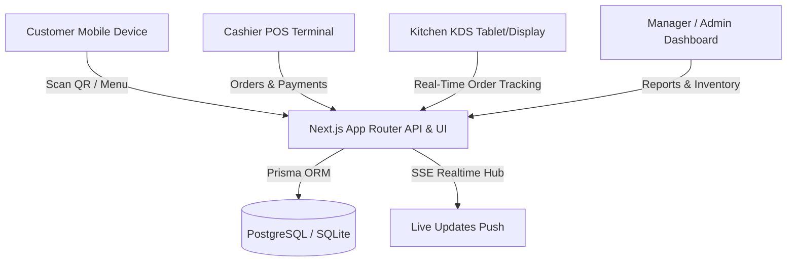

# System Architecture - SMART RESTAURANT MANAGEMENT SYSTEM

## 1. Overview
SMART RESTAURANT MANAGEMENT SYSTEM (ระบบบริหารจัดการร้านอาหารอัจฉริยะ) is designed as a modern, high-performance, real-time enterprise SaaS application.

## 2. Core Modules
- **Customer QR Ordering System**: `/menu/[tableId]`
- **Real-Time Order Tracking**: `/order/[orderId]`
- **POS Cashier System**: `/pos`
- **Kitchen Display System (KDS)**: `/kitchen`
- **Table Management**: `/tables`
- **Inventory & BOM Recipe Stock Deduction**: `/inventory`
- **Executive Dashboard & Analytics**: `/dashboard`
- **Financial & Sales Reports**: `/reports`
- **Investment & Profit Sharing Module**: `/investment`
- **User & Multi-Branch Management**: `/admin/users`, `/admin/branches`
